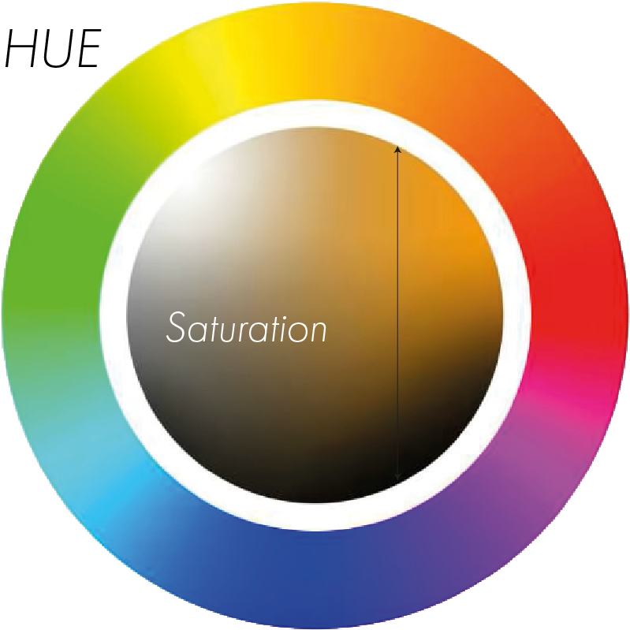

# Saturation

The Saturation of a Color describes its Intensity. 
If a Color is more saturated, it appears more intense, as oposed to appearing more grey, when less saturated.
Therefore Gray is just any Color without any Saturation.

The Saturation is represented by going left and right on the Color-Wheel.

