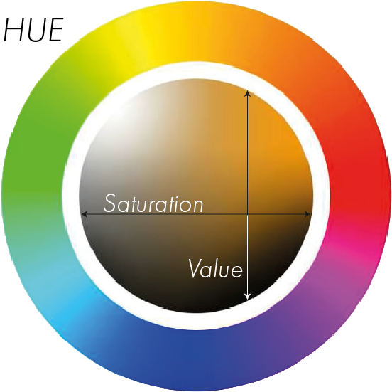

# Value

The Value of a Color describes how light or dark that Color is.
It is split into Tint and Shade

- Shade - Darkness of the Color
- Tint - Lightness of the Color

In Terms of Mixing Colors with paint, you can think of shifting the Value of the Color by adding Black to add Shade and 
adding White to add Tint to the Color.

The Value of a Color is represented by going up and down on the Color-Wheel.

