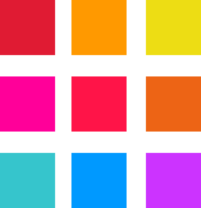

## Analog

Monochromatic Color-Groups, are Groups of 3 Colors, that are adjacant to eachother on the Colorwheel. These Groups feel harmonic and cohesive and can create simple, but strong design.

Some Analog Color-Groups can be:

