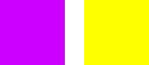
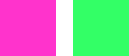

# Exercises 

## Exercise 1:

### Monochromatic

Below, you will find three Images. Try to identify, which of the Color-Groups shown are Monochromatic.

- 1

- 2

- 3

### Create your own

In your Image Manipulation Programm, create 3 - X of the same Form with the same Color. Now try to shift the Value and the Saturation of each of the new Forms, without changing the HUE to create a Monochromatic Color-Scheme. Try to make it harmonic, or to assign each a role, like Main-Color, Accent, Highlight, Background, Success, Failure, etc.

## Exercise 2:

### Analog

Below, you will find three Images. Try to identify, which of the Color-Groups shown are Analog.

- 1

- 2

- 3

### Create your own

In your Image Manipulation Programm, create 3 of the same Form with the same Color. Now try to shift the HUE of the second Form to the Color to the right of the original Color on the Color wheel. Try the same with the third shape, but with the Color to the left. Align them in the correct order.

You can also try to shift each of the Values and Saturations to see how the changes feel.

## Exercise 3:

### Complementary

Below, you will find three Images. Try to identify, which of the Color-Groups shown are Complementary Colors.

- 1

- 2

- 3

### Create your own

In your Image Manipulation Programm, create a new Form and give it a random Color of your choice. Now duplicate that Form and change the Color of the new Form to its complementary Color.

Try to experiment with different sizes between the Forms, different amounts of Forms with the two Colors or with Placement of those Forms and see how the Relation between the Colors changes.

You can also try the following Website to create an according complementary Color:

- https://colorkit.org/split-complementary-color-scheme
